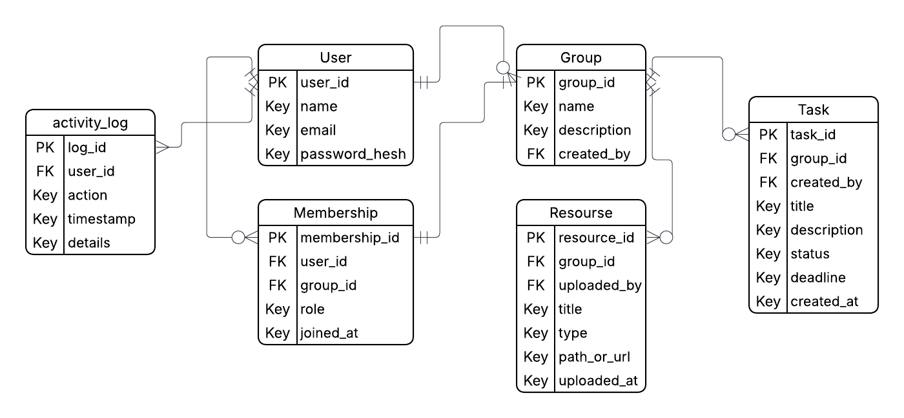
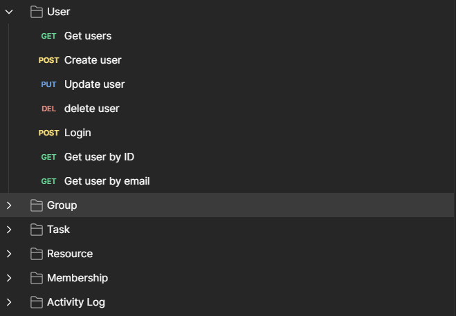

# Collab-study

## 1. Stručný popis projektu

**Collab-Study** je desktopová aplikácia vytvorená ako dvojmodulový Maven projekt, pozostávajúci z:

- **server/** – backend (Spring Boot 3, SQLite, REST API, WebSocket)
- **client/** – desktopový klient (JavaFX 21, FXML, HttpClient)

Cieľom aplikácie je umožniť študentom spolupracovať v študijných skupinách, zdieľať úlohy, zdroje a dostávať aktualizácie v reálnom čase. Každý používateľ môže:

- vytvárať a spravovať študijné skupiny,
- pridávať členov s rolami (`OWNER`, `ADMIN`, `MEMBER`),
- vytvárať, upravovať a sledovať úlohy,
- nahrávať a editovať študijné materiály,
- vidieť automatické zmeny v úlohách a zdrojoch v reálnom čase (WebSocket),
- prezerať si históriu aktivít (log udalostí).

Aplikácia pozostáva z troch hlavných častí:

### **JavaFX klient**

Používateľské rozhranie bežiace ako desktopová aplikácia.

**Prihlasovacie okno:**

**Záložka Groups:**

**Záložka Tasks:**

**Záložka Resources:**

Klient komunikuje cez:
- REST API (`java.net.http.HttpClient`)
- WebSocket (`ws://localhost:8080/ws/updates`) pre aktualizácie v reálnom čase

---

### **Backend – Spring Boot**

Backend poskytuje:

- REST API pre všetky entity
- validáciu vstupov
- zabezpečenie správou rolí
- WebSocket pre real-time oznámenia
- SQLite databázu s entitami:
  `User`, `Group`, `Membership`, `Task`, `Resource`, `ActivityLog`

---

### **Databáza – SQLite**

Databázový model:

---

## 2. Architektúra systému

Systém je navrhnutý ako **klient–server aplikácia**, kde komunikácia prebieha:
- synchronne cez **REST API**
- asynchrónne cez **WebSocket**

---

### 2.1 Serverová architektúra (Spring Boot)

Backend pozostáva z vrstiev:

- **Controller vrstva**  
  Definuje REST API – používateľ, skupiny, úlohy, zdroje, členstvo, logy, WebSocket.

- **Service vrstva**  
  Obsahuje logiku pre logovanie aktivít (`ActivityLogService`).

- **Repository vrstva**  
  Implementovaná pomocou Spring Data JPA.

- **Databázová vrstva**  
  SQLite databáza `collab-study.db`.

---

### 2.2 Klientská architektúra (JavaFX)

JavaFX je rozdelená na:

- prihlasovací modul,
- hlavné okno (`MainController`),
- tri funkčné sekcie: **Groups**, **Tasks**, **Resources**,
- spracovanie WebSocket správ,
- dialógy: create/edit/change status.

Používajú sa DTO objekty a FXML rozhranie.

---

### 2.3 Komunikácia klient ⇄ server

#### REST API
Používa sa na:
- získanie dát,
- vytváranie úloh/skupín,
- úpravu entít,
- mazanie,
- prihlasovanie.

Ukážka REST dotazu v Postmane:

#### WebSocket
Používa sa na push udalosti:

- `TASK_CREATED`, `TASK_UPDATED`, `TASK_STATUS_CHANGED`, `TASK_DELETED`
- `RESOURCE_CREATED`, `RESOURCE_UPDATED`, `RESOURCE_DELETED`

Po prijatí udalosti klient automaticky obnoví obsah tabuľky.

---

## 3. Databázový model

Databázová schéma zahŕňa tabuľky:

- users
- groups
- memberships
- tasks
- resources
- activity_log

Každá entita má vzťahy definované pomocou JPA anotácií.

> 

---

## 4. REST API a WebSocket

### Hlavné REST endpointy:

- `/api/users` – registrácia, login, správa používateľov
- `/api/groups` – správa skupín
- `/api/memberships` – členovia a roly
- `/api/tasks` – CRUD úloh
- `/api/resources` – zdieľané materiály
- `/api/activity` – log aktivít

### WebSocket endpoint:

Klient implementuje odchytávanie správ v `WebSocketClient.java`.

---

## 5. Používateľské rozhranie (JavaFX)

Aplikácia pozostáva zo štyroch hlavných obrazoviek:

1. **Login screen**
2. **Groups tab** (zobrazenie skupín + správa členov)
3. **Tasks tab** (tvorba, úprava, zmena stavu, mazanie)
4. **Resources tab** (materiály)

Každá záložka má vlastný controller, FXML súbor a podporuje:
- validáciu vstupov,
- komunikáciu s API,
- automatické aktualizácie z WebSocket.

---

## 6. Výzvy a riešenia

| Výzva | Riešenie |
|-------|----------|
| Synchronizácia údajov medzi viacerými klientmi | WebSocket broadcast a Live refresh v UI |
| Riadenie rolí (OWNER/ADMIN/MEMBER) | Logika v JavaFX + kontrola na serveri |
| Logovanie udalostí | `ActivityLogService` + REST endpointy |
| Správa databázy SQLite | JPA + automatická tvorba schémy |
| Oddelenie client/server | Maven multimodulový projekt |

---

## 7. Zhodnotenie práce s AI

Pri vývoji projektu bola AI využitá ako:
- konzultant architektúry,
- pomocník pri návrhu REST API,
- generátor návrhov UI,
- nástroj na ladeniu chýb v JavaFX/Spring,
- pomocník pri písaní dokumentácie.

AI výrazne zrýchlila vývoj, najmä vo fáze návrhu, refaktoringu kódu a pri riešení chýb.

---
