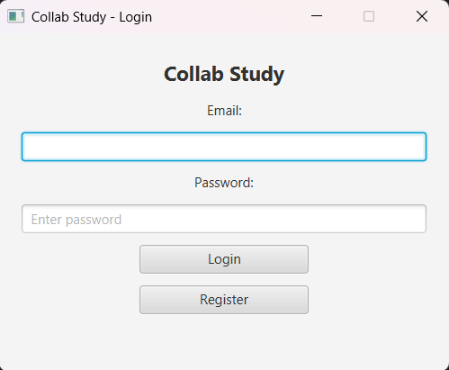
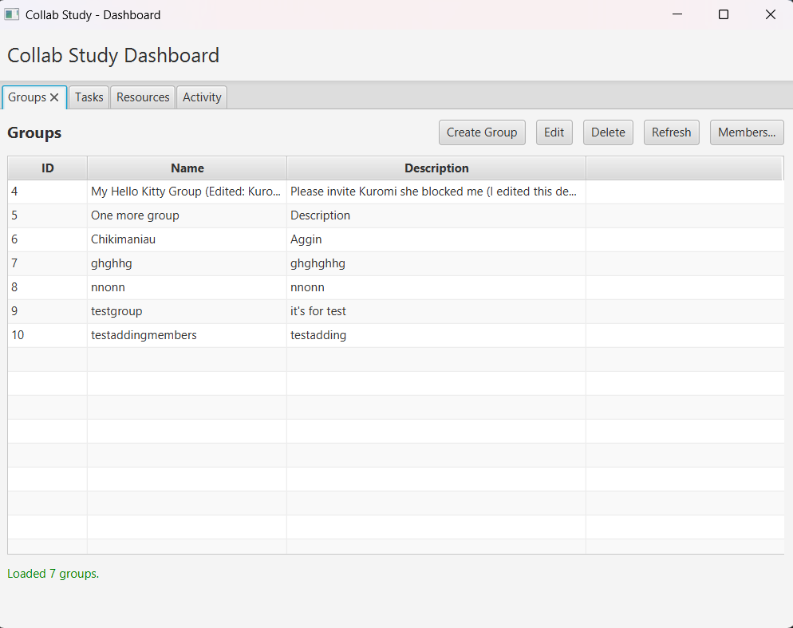
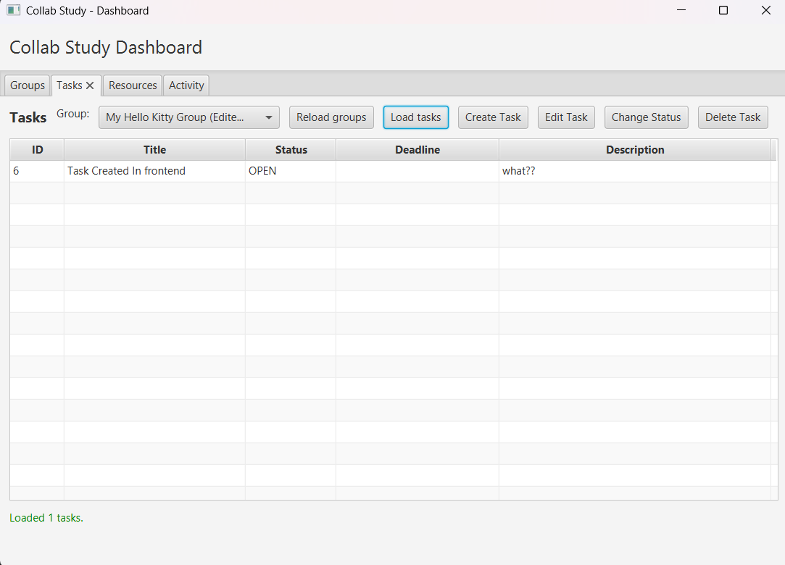
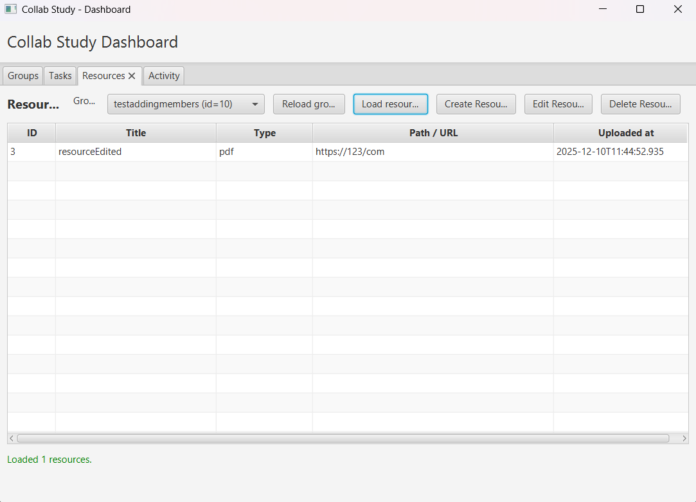

# Collab-study
**Collab-Study** je desktopová aplikácia vytvorená ako dvojmodulový Maven projekt, pozostávajúci z:

- **server/** – backend (Spring Boot 3, SQLite, REST API, WebSocket)
- **client/** – desktopový klient (JavaFX 21, FXML, HttpClient)

Cieľom aplikácie je umožniť študentom spolupracovať v študijných skupinách, zdieľať úlohy, zdroje a dostávať aktualizácie v reálnom čase. Každý používateľ môže:

- vytvárať alebo spravovať študijné skupiny,
- pridávať členov s rolami (`OWNER`, `ADMIN`, `MEMBER`),
- vytvárať, upravovať a sledovať úlohy,
- nahrávať a editovať študijné materiály,
- vidieť automatické zmeny v úlohách a zdrojoch v reálnom čase (WebSocket),
- prezerať si históriu aktivít (log udalostí).

------

### Aplikácia pozostáva z troch hlavných častí:

### **1. JavaFX klient**

JavaFX aplikácia zabezpečuje používateľské rozhranie.  
Po spustení používateľ vidí prihlasovacie okno:

> 

Po prihlásení sa otvorí hlavné okno aplikácie.
V hlavnom okne sa nachádzajú tri hlavné záložky:

- **Groups** — správa skupín, členov a rolí
  > 

- **Tasks** — vytváranie a správa úloh
  >

- **Resources** — nahrávanie a zdieľanie materiálov
  > 

Klient komunikuje so serverom pomocou:

- REST API (`java.net.http.HttpClient`)
- WebSocket pripojenia (`ws://localhost:8080/ws/updates`) na príjem real-time zmien

------

### **2. Backend – Spring Boot**

Backend poskytuje:

- komplexné REST API pre všetky entity:
    - `User`, `Group`, `Membership`, `Task`, `Resource`, `ActivityLog`
- validačné pravidlá (`@Valid`)
- správu rolí a oprávnení:
    - iba **OWNER/ADMIN** môžu vytvárať alebo mazať úlohy
    - iba **OWNER** môže pridávať členov
- pripojenie na databázu SQLite pomocou JPA/Hibernate
- WebSocket endpoint pre real-time push aktualizácie

Architektúra backendu pozostáva z vrstiev:

- **entity/**
- **repository/**
- **controller/**
- **service/** (napr. ActivityLogService)

------

### **3. Databáza – SQLite**

Databáza obsahuje tabuľky:

- `users`
- `groups`
- `memberships`
- `tasks`
- `resources`
- `activity_log`

K projektu patrí aj ER diagram:

> 🖼 **Sem vlož ER diagram**  
> _INSERT: docs/er-diagram.png_

------

### **Cieľ riešenia**

Hlavnou úlohou projektu je predviesť komplexnú spolupracujúcu architektúru:

- **JavaFX** (desktop UI)
- **Spring Boot** (REST + WebSocket)
- **SQLite** (perzistencia údajov)

Aplikačný tok znázorňuje kompletné životné cykly:

- používateľov,
- skupín,
- členstva,
- úloh,
- študijných materiálov,
- logovania aktivít.

Aplikácia podporuje aj **reálne-time spoluprácu**, napríklad keď jeden používateľ vytvorí úlohu, ostatní ju uvidia okamžite bez reloadu.

## 1. Stručný popis projektu

## 2. Architektúra systému

## 3. Databázový model

## 4. REST API a WebSocket

## 5. Používateľské rozhranie (JavaFX)

## 6. Výzvy a riešenia

## 7. Zhodnotenie práce s AI